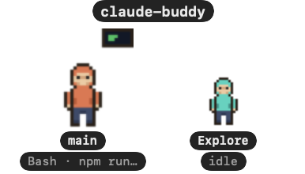

# Claude Buddy

A tiny always-on-top macOS widget: a pixel-art character that shows what Claude Code is doing.
It reads, types, runs commands, raises a hand with a speech bubble when Claude is waiting for you,
takes coffee breaks when bored, and spawns smaller clones for every subagent — each clone animates its own work and waves goodbye when it finishes.

<p align="center"></p>

Each Claude Code session gets its own buddy labelled with the project folder; subagents appear as
smaller tinted clones beside it, and the character grows as the context window fills up.

No hacks: Claude Code's built-in **HTTP hooks** POST every lifecycle event to `http://127.0.0.1:4789/event`.
The app is a ~500-line Swift package with a minimal HTTP listener and a SwiftUI sprite renderer.

## Install

```bash
tools/install.sh          # build, assemble ~/Applications/ClaudeBuddy.app, register hooks, launch
tools/install.sh --login  # same, plus a LaunchAgent so it starts at login
```

The installer backs up `~/.claude/settings.json` before merging the `hooks` block from
`hooks/settings.hooks.json`. Hooks are `async`, so Claude Code never waits on the widget, and when
the app isn't running the POSTs simply fail silently.

## Develop

```bash
python3 tools/gen_sprites.py   # regenerate placeholder sprite sheets
swift build && .build/debug/ClaudeBuddy &
tools/replay.sh                # send a scripted fake session (no Claude needed)
tools/replay.sh --snapshot /tmp/buddy.png   # also render the panel to a PNG mid-replay
```

Menu bar icon → Show/Hide, Reset position, Play demo, Do a trick, Quit. Drag the character anywhere; the
position is remembered.

## How events map to poses

| Hook event | Pose |
|---|---|
| `SessionStart` | sparkles, "hej!" |
| `UserPromptSubmit`, and after every `PostToolUse` until the next tool | hand on chin, thought bubble, "pondering…" |
| `PreToolUse` Read / Grep / Glob / WebFetch | reading a book |
| `PreToolUse` Edit / Write | sits down at a desk and types, code appearing on the monitor |
| `PreToolUse` Bash | terminal window |
| `PreToolUse` Agent, `SubagentStart` | sparkles; a smaller tinted clone appears labelled with the agent type |
| `SubagentStop` | clone waves, fades out |
| `PostToolUseFailure` | startled, sweat drop |
| `PermissionRequest`, `Notification` permission_prompt | hand raised, bobbing speech bubble with "may I? Bash · git push" |
| `Notification` agent_needs_input / elicitation_dialog | hand raised, speech bubble with Claude's question |
| `Stop`, `Notification` idle_prompt | idle loop with blink |
| context grew since last check | eating a cookie, "nom nom · +12k" |
| idle for a while | random tricks: coffee break, dancing with headphones, juggling |
| 55 s without events | stretches and yawns |
| 60 s without events | sleeping |
| `SessionEnd` | waves, disappears |
| no session at all | mines fake BTC with a pickaxe; the wallet and idle time show below |

Events carry `agent_id`, so tool calls made *inside* a subagent animate that clone, not the main character.

**Context size = body size.** Every event names the session's transcript; the app reads the tail of that
`.jsonl` (or the subagent's file under `<session>/subagents/`) and takes the latest assistant turn's
input + cache tokens as the context in use. The sheet has four body widths; the character steps up one
size for every 25 % of the window used, and the label shows the count, e.g. `shack-products · 115k`.
Past 50 % the character flushes, steams and shows a load gauge; past 75 % it is dizzy, trembling and the gauge blinks red.
The window size (200k or 1M) is a toggle in the menu bar.
Multiple concurrent Claude sessions each get their own character (labelled with the project folder).

## Replace the art

Sprite sheets live in `Sources/ClaudeBuddy/Resources/buddy.png` (main) and `buddy_1..4.png` (clone tints).
Grid: 32×32 px frames, 4 columns, one animation per row in this order:
`idle(4) read(2) type(4) run(2) wait(2) sleep(2) oops(2) wave(2) spawn(2) eat(3) mine(4) coffee(4) dance(4) stretch(3) juggle(4) think(4)`,
repeated as one block per fat level (normal → fattest; the app derives the level count from the sheet height).
Drop in your own PNGs with the same grid and rebuild. Frame counts / fps per row are in `Pose` in `Model.swift`.
